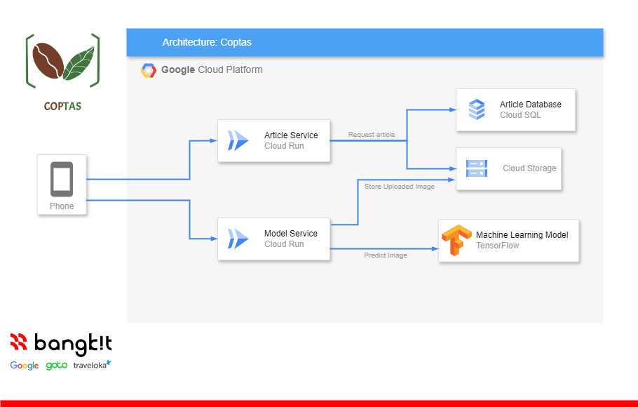

# [C241-PS120] COPTAS (Coffee Protection and Analysis System)

We are the Bangkit H1 2024 Product-Track Capstone Project Team. This project contains the repositories for the Coffee Protection and Analysis System project.

COPTAS (Coffee Protection and Analysis System) is an application that can detect coffee leaf disease. This application can be used to prevent decreasing productivity on coffee because of disease.

## System Architecture

## Team Members

| ID  | Name | Learning Path | University | Profile |
| ------------- | ------------- | ------------- | ------------- | ------------- |
| M327D4KY3210  | Muhammad Izza Iqbal  | ML | Universitas Teknologi Yogyakarta | [LinkedIn](https://www.linkedin.com/in/example/) |
| M737D4KY2637  | Caku  | ML | STKIP Persada Khatulistiwa | [LinkedIn](https://www.linkedin.com/in/example/) |
| M189D4KY2307  | Ilham Dio Putra  | ML | Universitas Bengkulu | [LinkedIn](https://www.linkedin.com/in/ilham-dio-putra-36a753216/) |
| C010D4KY0960  | Septio Nugroho  | CC | Universitas Indonesia | [LinkedIn](https://www.linkedin.com/in/septio-nugroho-174a9b1ba/) |
| C189D4KY0335  | Arief Satrio Budi Prasojo  | CC | Universitas Bengkulu | [LinkedIn](https://www.linkedin.com/in/arief-satrio-budi-prasojo) |
| A121D4KY3590  | Muhammad Irgy Syah Daffa  | MD | Universitas Telkom Surabaya | [LinkedIn](https://www.linkedin.com/in/irgydaffa/) |
| A189D4KY4129  | Fajar Adhitia Suwandhi | MD | Universitas Bengkulu | [LinkedIn](https://www.linkedin.com/in/fajar-adhitia-suwandhi-418a56221/) |
